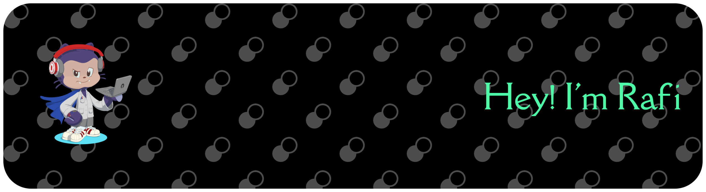

<!-- ## Hello I'm **Rafi Akbar** 👋 -->

<!-- ##  -->

# 💫 About Me:

🚀 I'm currently working on Building web apps & AI automation projects. 💡 I'm looking for help with Landing my first tech job and growing my skills. 📚 I'm currently learning Laravel, n8n, AI Agents, and backend development. 💬 Ask me about Laravel, automation, AI, or anything tech. ⚡ Fun fact I can spend hours fixing one bug... just to find a missing semicolon. 😭

## 🌐 Socials:

  

# 💻 Tech Stack:

               

# 📊 GitHub Stats:

<!--   -->

 

<!--  -->

---

<!-- Proudly created with GPRM ( https://gprm.itsvg.in ) -->

###

###
